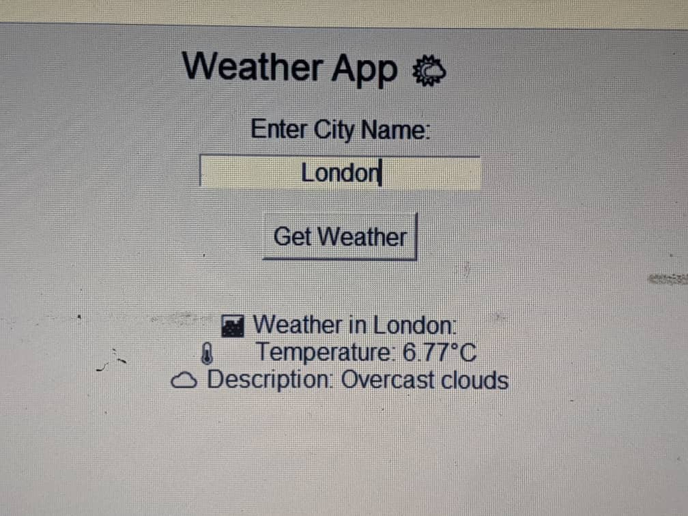

# Simple Weather App 🌦️

This is a simple Python-based weather application that fetches real-time weather data using the OpenWeatherMap API. It demonstrates the basic concepts of Python, such as API integration, handling JSON responses, and displaying data in a user-friendly way.

## Screenshot



*(Above: A preview of the Weather App interface displaying weather details.)*


## Features
- Fetches real-time weather data for a given city.
- Displays temperature, weather condition, and other details.
- Easy-to-use and beginner-friendly.

## Concepts Covered
### Python Basics
- **Variables**: Store and manage data (e.g., `city`, `temperature`).
- **Functions**: Organize code into reusable blocks (e.g., `fetch_weather_data`).
- **Control Structures**: Handle conditions and loops.
- **Libraries**: Use external libraries like `requests` for HTTP requests.

### API Usage
- **API Integration**: Communicate with OpenWeatherMap's API to fetch weather data.
- **HTTP GET Request**: Use the `requests` library to send API requests.
- **API Key**: Authenticate API requests with a unique key.
- **JSON Parsing**: Parse JSON responses to extract relevant data.

## How It Works
1. The user enters the name of a city.
2. The application sends a GET request to the OpenWeatherMap API with the city name and API key.
3. The API returns weather data in JSON format.
4. The application extracts and displays the temperature, weather conditions, and more.

## Installation
1. Clone the repository:
   ```bash
   git clone https://github.com/TariqNew/Simple_weather_app.git
   cd Simple_weather_app
